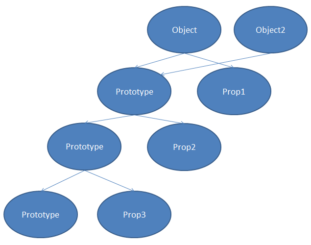

# Prototype inheritance and function constructor

## specific noun

###### function constructor

A normal function that is used to construct object.

###### Inheritance

Object get access to other object's properties or methods, we say your object inhertance the other one.

## Prototype inheritance

In JavaScript, each Object has a property pointing to another object called "prototype". The object inherits from the prototype. Therefore, the object can access properties and methods of the prototype. The prototype also has its proeprties and also it's own prototype. So the prototype can access properites of its prototype. That is called "Prototype chain". And the object can access all the properpties of prototypes in the prototype chain.

Then we can make another object to inherits prototype, then the object can access all the properties on the block chain.

